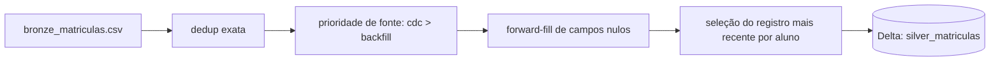

# Lakehouse Education

Projeto de estudo para praticar arquitetura medallion (Bronze, Silver, Gold) com Delta Lake e PySpark, usado como preparação para testes técnicos de engenharia de dados. O foco é resolver, com código real e executável, cenários comuns de pipelines de dados: deduplicação, resolução de conflitos entre fontes, upsert idempotente e schema evolution.

## Visão geral / Arquitetura

O projeto segue o padrão medallion:

```
data/raw     -> pouso de arquivos brutos, ainda não versionados como tabela
data/bronze  -> eventos crus em CSV, com duplicidade e campos parciais esperados
data/silver  -> tabelas Delta consolidadas, um registro por entidade de negócio
data/gold    -> (planejado) métricas agregadas para consumo analítico
```

Fluxo implementado hoje:



A tabela Silver é escrita via `MERGE` (upsert) quando já existe, e via `overwrite` na primeira execução, o que torna o pipeline idempotente: reprocessar o mesmo lote não duplica nem corrompe dados.

## Status do projeto

### Implementado e funcionando

- **Pipeline Bronze -> Silver de matrículas** (`src/lakehouse_bronze_matriculas.py`): lê `data/bronze/bronze_matriculas.csv`, remove duplicatas exatas, aplica prioridade de fonte de ingestão (`cdc` sobre `backfill`) para desempate, faz forward-fill de campos nulos por aluno em ordem cronológica, seleciona o registro mais recente por `aluno_id` e grava em `data/silver/silver_matriculas` como tabela Delta, com merge idempotente.
- **Dados de exemplo**: `data/bronze/bronze_matriculas.csv` e `data/bronze/bronze_eventos.csv` cobrindo casos de duplicidade, múltiplas fontes e campos nulos.
- **Material de exercícios** (`docs/exercicios_teste_bernoulli.md`): 9 exercícios cobrindo deduplicação, schema evolution, agregações Silver -> Gold, modelagem dimensional (star schema e SCD), particionamento e data skew no Spark, MERGE/time travel/VACUUM no Delta Lake, governança com Unity Catalog e LGPD, e armadilhas de granularidade e overwrite em pipelines incrementais.

### Em andamento

- Nenhum pipeline em desenvolvimento ativo no momento. O repositório está sendo usado principalmente para estudo e resolução dos exercícios documentados.

### Roadmap / próximos passos

- Pipeline Bronze -> Silver para `bronze_eventos.csv` (eventos de veículo/telemetria), ainda não implementado.
- Camada Gold com agregações (ex.: `gold_engajamento_turma`, referenciada no Exercício 3), ainda não iniciada porque depende de mais de uma tabela Silver como fonte.
- Exemplo de schema evolution com Delta (`mergeSchema`), cobrindo o Exercício 2, ainda não implementado no código, apenas descrito no enunciado.
- Testes automatizados para o pipeline de matrículas, ainda inexistentes; prioridade baixa neste momento porque o projeto é de estudo individual, mas recomendado antes de qualquer reuso em produção.

## Pré-requisitos

- Python 3.12 ou superior (ver `.python-version`).
- Java (JDK 11 ou 17) instalado e acessível via `JAVA_HOME`, exigido pelo PySpark.
- [uv](https://docs.astral.sh/uv/) como gerenciador de dependências e ambiente virtual.
- Acesso à internet na primeira execução, pois `delta-spark` baixa os JARs do Delta Lake via Maven/Ivy na criação da `SparkSession`.

Não há variáveis de ambiente obrigatórias nem serviços externos (banco, fila, cloud) neste estágio do projeto: tudo roda localmente contra arquivos em `data/`.

## Instalação

```bash
git clone https://github.com/jpdagostin/lakehouse_education.git
cd lakehouse_education
uv sync
```

O comando `uv sync` cria o ambiente virtual em `.venv` e instala as dependências travadas em `uv.lock` (`pyspark`, `delta-spark`).

## Comandos de execução

### Rodar o pipeline localmente

```bash
uv run python src/lakehouse_bronze_matriculas.py
```

O script usa um caminho absoluto fixo (`PATH` no início do arquivo) apontando para `data/` dentro do repositório. Se você clonar o projeto em outro diretório, ajuste essa constante antes de rodar.

Para inspecionar o resultado gravado na Silver:

```bash
uv run python -c "
from pyspark.sql import SparkSession
from delta import configure_spark_with_delta_pip

builder = SparkSession.builder.appName('check_silver')
spark = configure_spark_with_delta_pip(builder).getOrCreate()
spark.read.format('delta').load('data/silver/silver_matriculas').show(truncate=False)
"
```

### Rodar com Docker

Não há `Dockerfile` nem `docker-compose.yml` no projeto no momento. A execução é feita diretamente no ambiente local via `uv`.

### Rodar testes

Ainda não há suíte de testes automatizados no repositório. Nenhum comando de teste está configurado em `pyproject.toml`.

### Rodar linters/formatadores

Ainda não há linter ou formatter configurado (ex.: `ruff`, `black`) em `pyproject.toml`. Recomenda-se adicionar `ruff` antes de qualquer contribuição maior, dado que o projeto já segue convenções de nomenclatura e comentários consistentes no código existente.

### Migrations, seeds ou orquestração

Não aplicável: o projeto não usa banco de dados relacional nem orquestrador (Airflow, dbt). Os "seeds" são os próprios arquivos CSV versionados em `data/bronze/`.

## Estrutura de pastas

```
.
├── data/
│   ├── raw/               # pouso de arquivos brutos ainda não processados (vazio hoje)
│   ├── bronze/             # eventos crus em CSV, com duplicidade e campos parciais
│   ├── silver/             # tabelas Delta consolidadas (parquet + _delta_log)
│   └── gold/               # métricas agregadas para consumo analítico (planejado, vazio hoje)
├── docs/
│   └── exercicios_teste_bernoulli.md   # exercícios de estudo/preparação técnica
├── src/
│   └── lakehouse_bronze_matriculas.py  # pipeline Bronze -> Silver de matrículas
├── pyproject.toml         # metadados do projeto e dependências
├── uv.lock                # lockfile de dependências geradas pelo uv
└── .python-version        # versão de Python fixada para o projeto
```

## Boas práticas de código adotadas no projeto

- **Nomenclatura**: variáveis e funções em `snake_case`, seguindo convenção Python (PEP 8); nomes de colunas em português para refletir a linguagem do domínio de negócio (ex.: `aluno_id`, `data_evento`, `fonte_ingestao`).
- **Convenção de commits**: mensagens seguindo o padrão [Conventional Commits](https://www.conventionalcommits.org/) (ex.: `feat(bronze-matriculas):`, `docs(exercicios):`, `chore(deps):`), com escopo entre parênteses indicando a área afetada.
- **Branches**: o histórico atual foi desenvolvido diretamente em `main`; para novas features recomenda-se criar branches descritivas (ex.: `feat/gold-engajamento-turma`) antes de abrir PR.
- **Tipagem**: o schema de leitura do CSV é definido explicitamente via `StructType`/`StructField` em vez de inferido, garantindo leitura determinística e resiliente a variações na origem dos dados.
- **Tratamento de erros e logging**: o pipeline atual não falha silenciosamente porque depende de operações Spark que já lançam exceção em caso de schema incompatível ou falha de leitura/escrita; não há supressão de exceções (`try/except` vazio) em nenhum ponto do código.
- **Separação de responsabilidades**: o script de matrículas segue etapas claras e sequenciais (leitura, deduplicação, priorização de fonte, forward-fill, seleção do registro final, escrita), cada uma isolada em um bloco comentado, facilitando extração futura em funções caso o pipeline cresça.
- **Testes automatizados**: ainda não implementados; ver seção de roadmap. Recomendado antes de qualquer uso do pipeline fora de contexto de estudo.
- **Comentários**: o código comenta o "porquê" de cada decisão de negócio (ex.: por que `cdc` tem prioridade sobre `backfill`, por que o dedup ignora `evento_id`), não o "o quê" da sintaxe Spark. Comentários óbvios são evitados.
- **Linter/formatter**: ainda não configurado; ver seção de roadmap.
- **Configuração via variáveis de ambiente**: o projeto ainda usa um caminho absoluto hardcoded (`PATH` em `lakehouse_bronze_matriculas.py`) por ser um projeto de estudo local; para qualquer uso além do ambiente de desenvolvimento do autor, esse caminho deveria ser parametrizado via variável de ambiente ou argumento de linha de comando.
- **Documentação de funções públicas**: o módulo principal usa um docstring de módulo detalhado (contexto de negócio, entrada, saída e efeito colateral) em vez de docstrings por função, já que o script é procedural e não expõe funções reutilizáveis; ao extrair funções, cada uma deve documentar parâmetros, retorno e efeitos colaterais.
- **Versionamento semântico**: não aplicável no momento, pois o projeto não é publicado como pacote/biblioteca (`pyproject.toml` mantém `version = "0.1.0"` como placeholder de projeto interno).

## Como contribuir

Como este é um projeto pessoal de estudo, não há processo formal de revisão por terceiros, mas o fluxo recomendado para futuras contribuições é:

1. Criar uma branch a partir de `main` com nome descritivo (ex.: `feat/nome-da-feature`, `fix/nome-do-bug`).
2. Implementar a mudança seguindo as convenções de nomenclatura e comentários já usadas no projeto.
3. Rodar o pipeline afetado localmente e validar o resultado gravado em `data/silver/` ou `data/gold/` antes de commitar.
4. Escrever a mensagem de commit no padrão Conventional Commits.
5. Abrir um Pull Request descrevendo o contexto de negócio da mudança, não apenas o código alterado.

Checklist antes de abrir PR:

- O pipeline roda de ponta a ponta sem erro com `uv run python src/...`.
- Nenhum caminho absoluto pessoal foi deixado hardcoded fora do necessário.
- Novas colunas ou tabelas Delta têm o schema final documentado no PR.

## Licença e contato

Projeto pessoal sem licença definida até o momento. Para dúvidas ou sugestões, entre em contato com o autor, João Pedro Dagostin.
