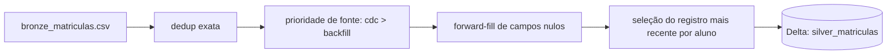

# Lakehouse Education

Projeto de estudo para praticar arquitetura medallion (Bronze, Silver, Gold) com Delta Lake e PySpark, usado como preparação para testes técnicos de engenharia de dados. O foco é resolver, com código real e executável, cenários comuns de pipelines de dados: deduplicação, resolução de conflitos entre fontes, upsert idempotente e schema evolution.

## Visão geral / Arquitetura

O projeto segue o padrão medallion:

```
data/raw     -> pouso de arquivos brutos, ainda não versionados como tabela
data/bronze  -> eventos crus em CSV, com duplicidade e campos parciais esperados
data/silver  -> tabelas Delta consolidadas, um registro por entidade de negócio
data/gold    -> (planejado) métricas agregadas para consumo analítico
```

Fluxo implementado hoje:



A tabela Silver é escrita via `MERGE` (upsert) quando já existe, e via `overwrite` na primeira execução, o que torna o pipeline idempotente: reprocessar o mesmo lote não duplica nem corrompe dados.

## Status do projeto

### Implementado e funcionando

- **Pipeline Bronze -> Silver de matrículas** (`src/lakehouse_bronze_matriculas.py`): lê o CSV de matrículas, remove duplicatas exatas, aplica prioridade de fonte de ingestão (`cdc` sobre `backfill`) para desempate, faz forward-fill de campos nulos por aluno em ordem cronológica, seleciona o registro mais recente por `aluno_id` e grava em Delta, com merge idempotente. A lógica é exposta como funções puras (`read_bronze_matriculas`, `transform_bronze_to_silver`, `write_silver_matriculas`) parametrizadas por `spark`/caminhos, para permitir testes isolados sem depender dos arquivos reais em `data/`.
- **Dados de exemplo**: `data/bronze/bronze_matriculas.csv` e `data/bronze/bronze_eventos.csv` cobrindo casos de duplicidade, múltiplas fontes e campos nulos.
- **Material de exercícios** (`docs/exercicios_teste_sistema_de_educacao.md`): 9 exercícios cobrindo deduplicação, schema evolution, agregações Silver -> Gold, modelagem dimensional (star schema e SCD), particionamento e data skew no Spark, MERGE/time travel/VACUUM no Delta Lake, governança com Unity Catalog e LGPD, e armadilhas de granularidade e overwrite em pipelines incrementais.
- **Pipeline Raw -> Bronze de eventos de acesso** (`src/lakehouse_bronze_eventos_acesso.py`, Exercício 2 do material de estudo): consolida três lotes de eventos de acesso à plataforma (`data/raw/raw_eventos_dia_1.csv`, `raw_eventos_dia_2.csv`, `raw_eventos_dia_3.json`), cada um com um schema diferente (o dia 2 adiciona a coluna `dispositivo`; o dia 3 adiciona o campo aninhado `metadata` e chega em JSON em vez de CSV), em uma única tabela Delta `bronze_eventos_acesso`, usando leitura genérica por formato (`read_raw_eventos_batch`) e escrita incremental com evolução automática de schema (`append` + `mergeSchema=true`). Registros de lotes anteriores a uma coluna nova passam a tê-la como `null`, sem perda ou truncamento de dado.
- **Pipeline Silver -> Gold de engajamento por turma** (`src/lakehouse_gold_engajamento_turma.py`, Exercício 3 do material de estudo): agrega `silver_submissoes` por `escola_id`/`turma_id`/`disciplina`/mês, calculando total de submissões, taxa de acerto, tempo médio gasto e alunos distintos, com escrita idempotente (overwrite na primeira execução, `MERGE` nas seguintes).
- **Pipeline Silver -> Gold em star schema para avaliações** (`src/lakehouse_gold_star_schema_avaliacoes.py`, Exercício 4 do material de estudo): modela `fato_avaliacoes` e as dimensões `dim_aluno`, `dim_escola`, `dim_disciplina` e `dim_tempo` a partir de `silver_avaliacoes`, `silver_escolas`, `silver_disciplinas` e `silver_matriculas` (única fonte disponível de atributos de aluno, já que não existe uma `silver_alunos` dedicada). `dim_escola` implementa SCD tipo 2 (histórico de mudança de atributo, ex.: mudança de `rede`, via `data_inicio_validade`/`data_fim_validade`/`flag_atual`); `dim_aluno` e `dim_disciplina` são dimensões de estado atual; `dim_tempo` é um calendário completo gerado (não derivado do fato). Chaves substitutas via `sha2` determinístico da chave natural (exceto `dim_escola`, cuja chave incorpora o timestamp de escrita da versão, necessário para diferenciar múltiplas versões da mesma escola).
- **Testes automatizados** (`tests/`): suíte `pytest` cobrindo dedup exato, desempate por prioridade de fonte, forward-fill de campos nulos, seleção do registro mais recente e idempotência do merge na Silver (matrículas), evolução de schema entre lotes e consulta tolerante a campo aninhado ausente (eventos de acesso), agregações e granularidade da Gold de engajamento, e SCD2/calendário/resolução de FK por data no star schema de avaliações, usando `SparkSession` local e arquivos temporários (`tmp_path`), sem tocar em `data/` real.
- **CI** (`.github/workflows/ci.yml`): pipeline no GitHub Actions que roda lint (`ruff check`), verificação de formatação (`ruff format --check`) e testes com cobertura (`pytest --cov`) a cada push/PR em `main`.

### Em andamento

- Nenhum pipeline em desenvolvimento ativo no momento. O repositório está sendo usado principalmente para estudo e resolução dos exercícios documentados.

### Roadmap / próximos passos

- Exercícios 5 a 9 do material de estudo (particionamento e data skew, MERGE/time travel/VACUUM, governança Unity Catalog/LGPD, granularidade para consumo via MCP, pegadinha de overwrite incremental): ainda não implementados, apenas descritos no enunciado.

## Pré-requisitos

- Python 3.12 ou superior (ver `.python-version`).
- Java (JDK 17, versão usada no CI) instalado e acessível via `JAVA_HOME`, exigido pelo PySpark.
- [uv](https://docs.astral.sh/uv/) como gerenciador de dependências e ambiente virtual.
- Acesso à internet na primeira execução, pois `delta-spark` baixa os JARs do Delta Lake via Maven/Ivy na criação da `SparkSession`.

Não há variáveis de ambiente obrigatórias nem serviços externos (banco, fila, cloud) neste estágio do projeto: tudo roda localmente contra arquivos em `data/`.

## Instalação

```bash
git clone https://github.com/jpdagostin/lakehouse_education.git
cd lakehouse_education
uv sync --group dev
```

O comando `uv sync --group dev` cria o ambiente virtual em `.venv` e instala tanto as dependências de execução (`pyspark`, `delta-spark`) quanto as de desenvolvimento (`pytest`, `pytest-cov`, `ruff`), travadas em `uv.lock`. Para instalar apenas as dependências de execução, use `uv sync`.

Se sua máquina tiver múltiplas JDKs instaladas, aponte `JAVA_HOME` explicitamente para uma versão 17 antes de rodar qualquer comando abaixo. JDKs mais recentes (testado com a versão 25) quebram a inicialização do Spark com o erro `JAVA_GATEWAY_EXITED`, pois o Hadoop empacotado no PySpark chama uma API (`Subject.getSubject`) removida nessas versões.

## Comandos de execução

### Rodar o pipeline localmente

```bash
uv run python src/lakehouse_bronze_matriculas.py
```

O script usa um caminho absoluto fixo (`PATH` no início do arquivo) apontando para `data/` dentro do repositório. Se você clonar o projeto em outro diretório, ajuste essa constante antes de rodar.

Para inspecionar o resultado gravado na Silver:

```bash
uv run python -c "
from pyspark.sql import SparkSession
from delta import configure_spark_with_delta_pip

builder = SparkSession.builder.appName('check_silver')
spark = configure_spark_with_delta_pip(builder).getOrCreate()
spark.read.format('delta').load('data/silver/silver_matriculas').show(truncate=False)
"
```

### Rodar com Docker

Não há `Dockerfile` nem `docker-compose.yml` no projeto no momento. A execução é feita diretamente no ambiente local via `uv`.

### Rodar testes

```bash
uv run pytest --cov=src --cov-report=term-missing
```

Os testes usam `pytest.ini_options` configurado em `pyproject.toml` (`pythonpath = ["src"]`), então os módulos de `src/` são importados diretamente, sem necessidade de instalar o projeto como pacote.

### Rodar linters/formatadores

```bash
uv run ruff check .
uv run ruff format .
```

Use `uv run ruff format --check .` (sem aplicar mudanças) para validar formatação, como feito no CI.

### Migrations, seeds ou orquestração

Não aplicável: o projeto não usa banco de dados relacional nem orquestrador (Airflow, dbt). Os "seeds" são os próprios arquivos CSV versionados em `data/bronze/`.

## Estrutura de pastas

```
.
├── .github/
│   └── workflows/
│       └── ci.yml          # pipeline de CI: lint, formatação e testes com cobertura
├── data/
│   ├── raw/               # pouso de arquivos brutos ainda não processados (vazio hoje)
│   ├── bronze/             # eventos crus em CSV, com duplicidade e campos parciais
│   ├── silver/             # tabelas/CSVs consolidados por entidade (matrículas, submissões, avaliações, escolas, disciplinas)
│   └── gold/               # métricas agregadas e star schema para consumo analítico
├── docs/
│   └── exercicios_teste_sistema_de_educacao.md   # exercícios de estudo/preparação técnica
├── src/
│   ├── lakehouse_bronze_matriculas.py            # pipeline Bronze -> Silver de matrículas
│   ├── lakehouse_bronze_eventos_acesso.py        # pipeline Raw -> Bronze de eventos de acesso
│   ├── lakehouse_gold_engajamento_turma.py       # pipeline Silver -> Gold de engajamento por turma
│   └── lakehouse_gold_star_schema_avaliacoes.py  # pipeline Silver -> Gold: star schema de avaliações
├── tests/
│   ├── conftest.py                                    # fixture de SparkSession compartilhada entre testes
│   ├── test_lakehouse_bronze_matriculas.py             # testes do pipeline de matrículas
│   ├── test_lakehouse_bronze_eventos_acesso.py         # testes do pipeline de eventos de acesso
│   ├── test_lakehouse_gold_engajamento_turma.py        # testes do pipeline de engajamento por turma
│   └── test_lakehouse_gold_star_schema_avaliacoes.py   # testes do star schema de avaliações
├── pyproject.toml         # metadados do projeto, dependências e configuração de pytest/ruff
├── uv.lock                # lockfile de dependências geradas pelo uv
└── .python-version        # versão de Python fixada para o projeto
```

## Boas práticas de código adotadas no projeto

- **Nomenclatura**: variáveis e funções em `snake_case`, seguindo convenção Python (PEP 8); nomes de colunas em português para refletir a linguagem do domínio de negócio (ex.: `aluno_id`, `data_evento`, `fonte_ingestao`).
- **Convenção de commits**: mensagens seguindo o padrão [Conventional Commits](https://www.conventionalcommits.org/) (ex.: `feat(bronze-matriculas):`, `docs(exercicios):`, `chore(deps):`), com escopo entre parênteses indicando a área afetada.
- **Branches**: o histórico atual foi desenvolvido diretamente em `main`; para novas features recomenda-se criar branches descritivas (ex.: `feat/gold-engajamento-turma`) antes de abrir PR.
- **Tipagem**: o schema de leitura do CSV é definido explicitamente via `StructType`/`StructField` em vez de inferido, garantindo leitura determinística e resiliente a variações na origem dos dados.
- **Tratamento de erros e logging**: o pipeline atual não falha silenciosamente porque depende de operações Spark que já lançam exceção em caso de schema incompatível ou falha de leitura/escrita; não há supressão de exceções (`try/except` vazio) em nenhum ponto do código.
- **Separação de responsabilidades**: o pipeline de matrículas é dividido em funções isoladas por etapa (`read_bronze_matriculas`, `transform_bronze_to_silver`, `write_silver_matriculas`), cada uma testável de forma independente, com um orquestrador (`run_bronze_to_silver_matriculas`) e um bloco `if __name__ == "__main__"` separando a lógica de negócio da execução como script.
- **Testes automatizados**: suíte `pytest` em `tests/` cobre os casos de negócio críticos do pipeline (dedup, prioridade de fonte, forward-fill, seleção do registro mais recente, idempotência do merge), usando `SparkSession` local e dados temporários. Rodada automaticamente no CI a cada push/PR.
- **Comentários**: o código comenta o "porquê" de cada decisão de negócio (ex.: por que `cdc` tem prioridade sobre `backfill`, por que o dedup ignora `evento_id`), não o "o quê" da sintaxe Spark. Comentários óbvios são evitados.
- **Linter/formatter**: `ruff` configurado em `pyproject.toml` (`[tool.ruff]`), rodando tanto localmente quanto como etapa obrigatória do CI (`ruff check` e `ruff format --check`). Ainda não há hook de pre-commit configurado para rodar isso automaticamente antes de cada commit.
- **Configuração via variáveis de ambiente**: o projeto ainda usa um caminho absoluto hardcoded (`PATH` em `lakehouse_bronze_matriculas.py`) por ser um projeto de estudo local; para qualquer uso além do ambiente de desenvolvimento do autor, esse caminho deveria ser parametrizado via variável de ambiente ou argumento de linha de comando.
- **Documentação de funções públicas**: o módulo principal usa um docstring de módulo detalhado (contexto de negócio, entrada, saída e efeito colateral) em vez de docstrings por função, já que o script é procedural e não expõe funções reutilizáveis; ao extrair funções, cada uma deve documentar parâmetros, retorno e efeitos colaterais.
- **Versionamento semântico**: não aplicável no momento, pois o projeto não é publicado como pacote/biblioteca (`pyproject.toml` mantém `version = "0.1.0"` como placeholder de projeto interno).

## Como contribuir

Como este é um projeto pessoal de estudo, não há processo formal de revisão por terceiros, mas o fluxo recomendado para futuras contribuições é:

1. Criar uma branch a partir de `main` com nome descritivo (ex.: `feat/nome-da-feature`, `fix/nome-do-bug`).
2. Implementar a mudança seguindo as convenções de nomenclatura e comentários já usadas no projeto.
3. Rodar o pipeline afetado localmente e validar o resultado gravado em `data/silver/` ou `data/gold/` antes de commitar.
4. Escrever a mensagem de commit no padrão Conventional Commits.
5. Abrir um Pull Request descrevendo o contexto de negócio da mudança, não apenas o código alterado.

Checklist antes de abrir PR:

- `uv run ruff check .` e `uv run ruff format --check .` passam sem erro.
- `uv run pytest --cov=src` passa e cobre o novo comportamento com pelo menos um teste.
- O pipeline roda de ponta a ponta sem erro com `uv run python src/...`.
- Nenhum caminho absoluto pessoal foi deixado hardcoded fora do necessário.
- Novas colunas ou tabelas Delta têm o schema final documentado no PR.
- O CI (`.github/workflows/ci.yml`) passa no PR antes do merge.

## Licença e contato

Projeto pessoal sem licença definida até o momento. Para dúvidas ou sugestões, entre em contato com o autor, João Pedro Dagostin.
